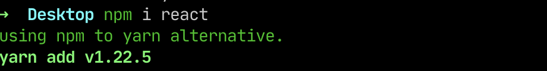

### Problem

I believe ya all would have the same problem like me who working mostly with JS & TS relate things.
Ya all would probably choose **yarn** over **NPM** not because npm is bad but because yarn is better.
But when search package on npm or google we always need to change from

```sh
npm i react //or npm install react
```

to

```sh
yarn add react
```

**Probably not the best experiences for us to change when copy those from npm or somewhere else**

### Solution

So i alias things in terminal directly so whenever you hit will redirect to yarn in your terminal.

```sh
npm i react //=> yarn add react
```

### How to ?

- Add this alias syntax to whatever terminal env you using like **bash, zsh, fish...**
- mine using zsh so `.zshrc` would by terminal configuration file.

```sh
# .zshrc
# Alias npm to yarn
npm() {
  GREEN="\e[32m"
  RED="\e[31m"
  if ! yarn -v yarn &> /dev/null
    then
        echo -e "${RED}yarn could not be found, make sure yarn is installed.${ENDCOLOR}"
        exit
    else
        echo -e "${GREEN}using npm to yarn alternative.${ENDCOLOR}"
  fi
  local -a args=( )
  for arg; do
    [[ $arg = -i ]] || args+=( "$arg" )
    [[ $arg = -install ]] || args+=( "$arg" )
  done
  command yarn add "${args[@]}"
}
```

- restart your terminal
- you will got magic


